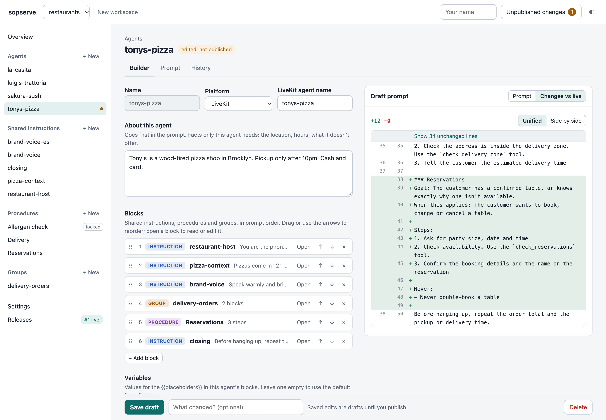
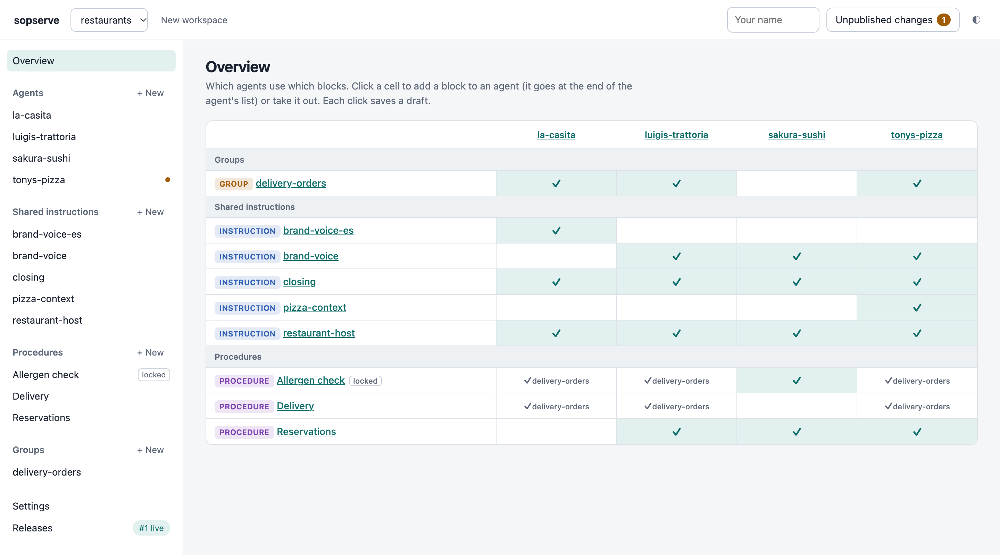
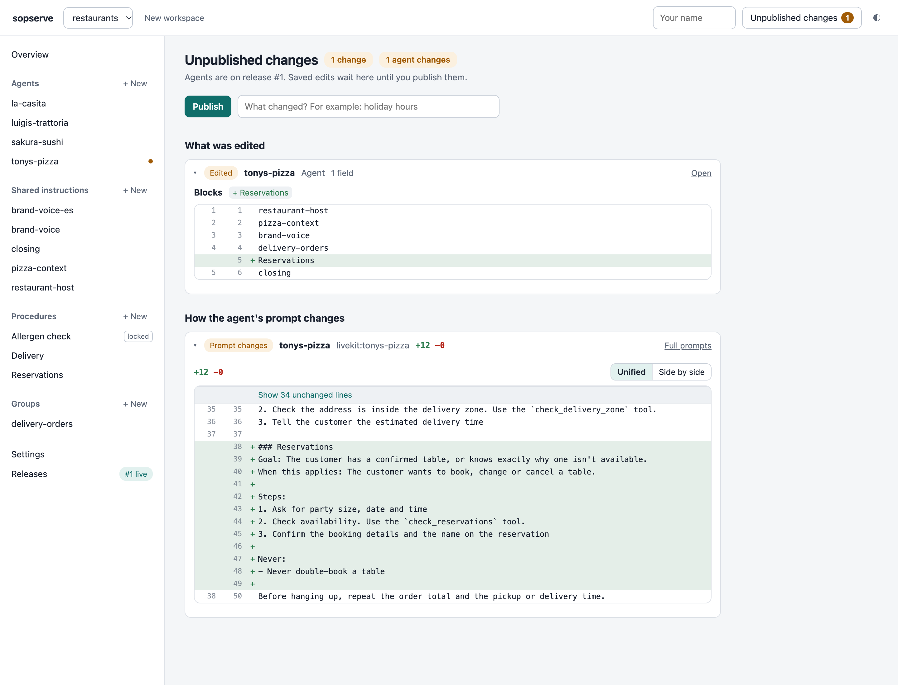

<div align="center">

# 📋🗄️ sopserve

**A server and UI for sopc agent instructions.**

Edit shared instructions and procedures in a browser, compose each agent from them,<br>
and publish releases your agents fetch when a call starts. No redeploys.

[Why](#why) · [Quickstart](#quickstart) · [How it works](#how-it-works) · [Use it from your agent](#use-it-from-your-agent) · [Git or database](#git-or-database) · [API](#api)

</div>

---

## Why

[sopc](https://github.com/amanmibra/sopc) keeps agent instructions in git and compiles one prompt per agent. Some teams would rather keep that config in a database, edit it in a UI, and not trigger a deploy for every wording change. sopserve is that: forms to edit blocks and compose agents, drafts and releases, and an API each agent calls when it starts. It compiles with the sopc binary itself, so its prompts match the CLI byte for byte.

<p align="center"></p>

## Quickstart

```sh
curl -fsSL https://raw.githubusercontent.com/amanmibra/sopc/main/install.sh | sh   # the sopc compiler
uv tool install 'sopserve @ git+https://github.com/amanmibra/sopserve'
sopserve --port 8484
```

Open http://localhost:8484, create a workspace, and add a shared instruction, a procedure and an agent. The API docs are at `/docs`.

With Docker, from a clone: `docker build -t sopserve . && docker run -p 8484:8484 sopserve`. Set `DATABASE_URL` to a Postgres URL in production (Supabase, Neon and RDS all work); without it, the container keeps SQLite in its `/data` volume.

| Variable | Default | |
|---|---|---|
| `DATABASE_URL` | `sqlite:///sopserve.db` | Any SQLAlchemy URL. `postgres://` URLs use psycopg 3 (`pip install 'sopserve[postgres]'`). |
| `SOPC_BIN` | `sopc` on `PATH` | The sopc binary: a build after v0.0.9 (without `locked`). |
| `HOST`, `PORT` | `127.0.0.1`, `8484` | Also `--host`, `--port`. |

## How it works

1. **Write blocks.** Shared instructions are text several agents get (identity, voice, policy). Procedures are step-by-step SOPs. A block doesn't say who uses it.
2. **Compose agents.** Each agent is its own text, then the blocks it lists, in prompt order. Groups name a set of blocks many agents share.
3. **Review the diff.** Every save is a draft. Unpublished changes shows what changed in each block and in each agent's prompt, plus any duplicated or conflicting instructions `sopc lint` finds (advisory).
4. **Publish a release.** A release is an immutable snapshot of every block plus the compiled prompts.
5. **Agents fetch their prompt at call start**, with the release and block versions it was built from.
6. **Roll back anytime** by making an older release live.

| | What it is |
|---|---|
| Shared instruction | Prompt text that isn't a procedure. |
| Procedure | Goal, when it applies, steps (with tools), never-do's, warning signs. |
| Group | A named, ordered list of blocks. An agent lists it like a block. |
| Agent | One per voice agent: platform id, its own text, its blocks in order, variables. |
| Release | What agents are served. Pin one per call for A/B tests. |

The Overview page shows every agent against every block, and a click adds or removes one:

<p align="center"></p>

Before you publish, Unpublished changes shows what was edited and exactly how each agent's prompt changes:

<p align="center"></p>

## Use it from your agent

At room start, fetch the prompt and record what the call ran on:

```python
import json, os, httpx
from livekit import api
from livekit.agents import Agent, AgentSession, JobContext

SOPSERVE = os.environ["SOPSERVE_URL"]  # e.g. http://sopserve.internal:8484/v1/workspaces/prod


async def fetch_prompt(agent_name: str, release: str | None = None) -> dict:
    """The agent's compiled prompt, plus the release and component versions it was built from."""
    params = {"release": release} if release else {}
    async with httpx.AsyncClient(timeout=5) as http:
        res = await http.get(f"{SOPSERVE}/agents/livekit:{agent_name}", params=params)
        res.raise_for_status()
        return res.json()


async def record_versions(room: str, sop: dict) -> None:
    """Save what this call ran on in the room metadata, so QA can trace it later."""
    async with api.LiveKitAPI() as lk:  # LIVEKIT_URL, LIVEKIT_API_KEY, LIVEKIT_API_SECRET
        await lk.room.update_room_metadata(api.UpdateRoomMetadataRequest(
            room=room,
            metadata=json.dumps({"sopc": {k: sop[k] for k in ("release", "hash", "components")}}),
        ))


async def entrypoint(ctx: JobContext):
    await ctx.connect()
    sop = await fetch_prompt(ctx.job.agent_name, release=os.environ.get("SOPC_RELEASE"))
    await record_versions(ctx.room.name, sop)

    session = AgentSession(...)
    await session.start(room=ctx.room, agent=Agent(instructions=sop["prompt"]))
```

For A/B tests, have your router pick a release per call (e.g. 70% current, 30% a candidate) and pass it as `?release=N`; the room metadata and the fetch log record which one ran.

## Git or database

**Database.** Everything lives in sopserve's database and is edited in the UI or over the `/config` API. Nobody edits YAML or Markdown, but each block is still stored as a sopc file and versioned on its own.

**Git.** The sopc folder lives in your repo, and CI publishes it on merge in one call:

```sh
python3 -c 'import json,pathlib; r=pathlib.Path("sops"); print(json.dumps({"files": {p.relative_to(r).as_posix(): p.read_text() for p in r.rglob("*") if p.is_file()}}))' \
  | curl -fsS -X POST -H 'Content-Type: application/json' -d @- "$SOPSERVE_URL/publish"
```

`build/` is ignored. A folder in the format of sopc v0.0.8 or earlier, or one that still sets `locked` (sopc v0.0.9), is refused with a message to run `sopc migrate`; a workspace stored that way shows a Convert page in the UI.

You can switch any time: `GET …/files?content=true` exports a workspace as sopc files to commit.

## API

Paths are under `/v1/workspaces/<ws>`. The full spec is at `/openapi.json` (SDKs generate from it), and [API.md](API.md) lists every endpoint.

| Endpoint | What it does |
|---|---|
| `GET …/agents/<agent>` | **Call start.** The prompt, release, hash, tools and the components it was built from. `?release=N` pins a release. |
| `GET …/agents/<agent>/prompt` | Just the prompt text. |
| `GET …/config` | Every agent, shared instruction, procedure, group and setting, as the forms edit them. |
| `…/config/{agents,instructions,procedures,groups}[/<id>]` | List, create, read, replace and delete each kind, with history. |
| `POST …/config/agents/<id>/blocks`, `DELETE …/blocks/<block>` | Add a block at the end of an agent's list, or take one out. |
| `POST …/config/agents/<id>/preview` | Compile an agent's unsaved fields, without saving. |
| `GET …/draft` | Unpublished changes: each item before and after, and each agent's prompt diff. |
| `POST …/releases`, `POST …/releases/<n>/activate` | Publish head; make an older release live. |
| `POST …/publish` | Replace every file and release, for CI. |
| `POST …/migrate` | Convert a workspace stored in an older sopc format (v0.0.8, or `locked` from v0.0.9). |

Errors from sopc come back as `422 {"valid": false, "issues": [...]}`, each issue naming the item and field it's about, in plain words.

## Status

v0. **There is no authentication yet**: anyone who can reach sopserve can read and change everything, so run it on a private network only.

## Roadmap

- API keys with scopes, and sign-in for the UI
- Renaming agents and blocks
- A webhook on publish
- Schema migrations (tables are created on startup today)

## Development

```sh
uv sync && SOPC_BIN=/path/to/sopc uv run pytest   # a sopc build after v0.0.9
```

## License

Apache-2.0
